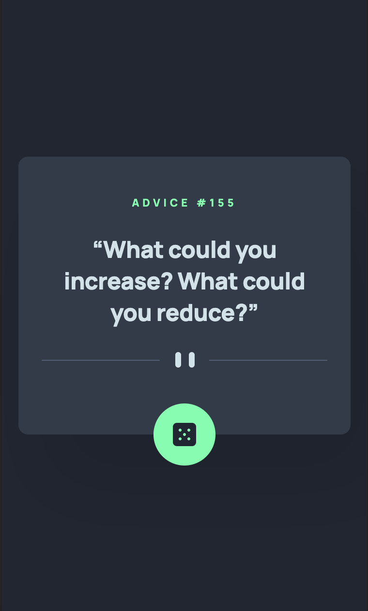
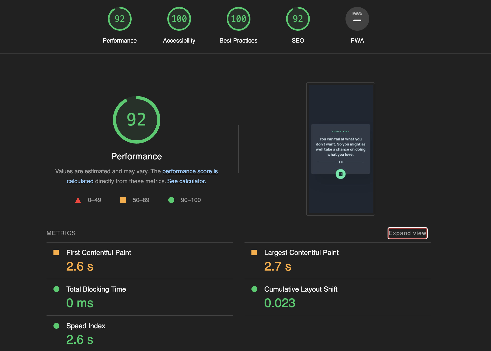

# Frontend Mentor - Advice generator app

This is a solution to the [Advice generator app challenge on Frontend Mentor](https://www.frontendmentor.io/challenges/advice-generator-app-QdUG-13db). Frontend Mentor challenges help you improve your coding skills by building realistic projects.

## Table of contents

- [Overview](#overview)
  - [The challenge](#the-challenge)
  - [Screenshot](#screenshot)
  - [Links](#links)
- [My process](#my-process)
  - [Built with](#built-with)
  - [Useful resources](#useful-resources)
- [Author](#author)

## Overview

### The challenge

Users should be able to:

- View the optimal layout for the app depending on their device's screen size
- See hover states for all interactive elements on the page
- Generate a new piece of advice by clicking the dice icon

### Screenshot

#### Desktop Screenshot

#### Mobile Screenshot

#### Report with Lighthouse

### Links

- Repository URL: [Click here!](https://github.com/huascarguillermo/advice-generator)
- Live Site URL: [Click here!](https://advice-generator-hg19.netlify.app)

## My process

### Built with

- Semantic HTML5 markup
- CSS custom properties
- Flexbox
- CSS Grid
- Module CSS
- Mobile-first workflow
- [React](https://reactjs.org/) - JS library
- [Advice Generator API](https://api.adviceslip.com)

### Useful resources

- [Element Picture](https://developer.mozilla.org/es/docs/Web/HTML/Element/picture) - This is an amazing article which helped me finally understand images depending on the screen size.

- [Animation Loading CSS](https://loading.io/css/) - This website helped me with loading animation when the website is getting the data.

## Author

- Frontend Mentor - [HGCodingg](https://www.frontendmentor.io/profile/HGCodingg)
- GitHub - [huascarguillermo](https://github.com/huascarguillermo)
